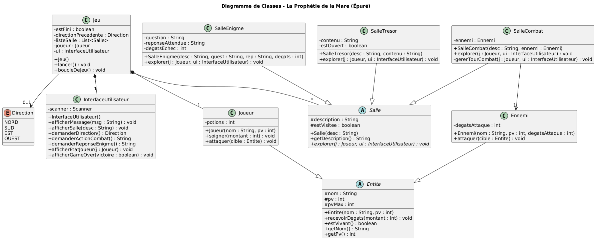
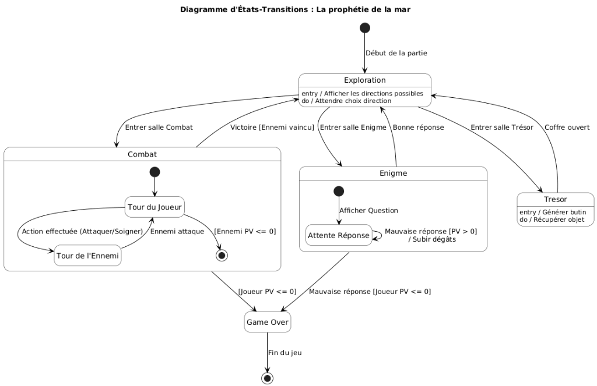
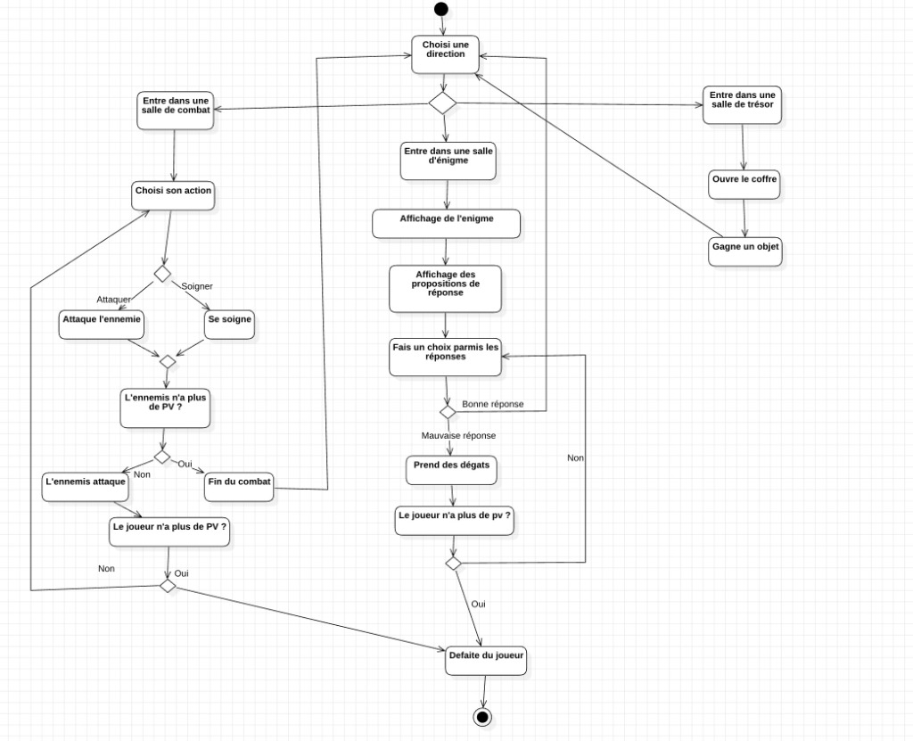

# La Prophétie de la Mare

Projet scolaire de jeu textuel en Java, basé sur une architecture UML stricte. <br>
Liens vers ce projet : https://github.com/aurelgeorges/la_prophecie_de_la_mare

## Sommaire

1.  [Manuel d'Utilisation](#manuel-dutilisation)
    *   [Description](#description)
    *   [Prérequis](#prérequis)
    *   [Installation et Compilation](#installation-et-compilation)
    *   [Lancer le Jeu](#lancer-le-jeu)
    *   [Règles du Jeu](#règles-du-jeu)
2.  [Conception Technique](#conception-technique)
    *   [Structure du Projet](#structure-du-projet)
    *   [Démarche de Conception](#démarche-de-conception)
    *   [Détail des Diagrammes UML](#détail-des-diagrammes-uml)
3.  [Auteurs](#auteurs)

---

# Manuel d'Utilisation

## Description
"La Prophétie de la Mare" est un jeu d'aventure en console où le joueur doit traverser une série de salles (Exploration, Combat, Énigme, Trésor) pour accomplir sa quête.

## Prérequis
*   **Java 17** ou supérieur
*   **Maven 3.6** ou supérieur

## Installation et Compilation

1.  Cloner le projet ou télécharger les sources.
2.  Ouvrir un terminal à la racine du projet.
3.  Compiler le projet avec Maven :

```bash
mvn clean package
```

Cette commande va :
*   Nettoyer les anciens builds (`clean`).
*   Compiler les sources Java.
*   Exécuter les tests unitaires.
*   Générer un fichier JAR exécutable dans le dossier `target/`.

## Lancer le Jeu

Une fois la compilation terminée, lancez le jeu avec la commande suivante :

```bash
java -jar target/prophetie-mare-1.0-SNAPSHOT.jar
```

## Règles du Jeu
*   Suivez les instructions à l'écran.
*   Choisissez vos actions (ATTAQUER, SOIGNER) lors des combats.
*   Résolvez les énigmes pour avancer sans dégâts.
*   Le jeu est linéaire, mais vous donne l'illusion du choix de direction.

---

# Conception Technique

Cette section détaille les choix architecturaux et la modélisation du projet.

## Structure du Projet

Le projet respecte l'architecture Maven standard :

*   `src/main/java/fr/troisil/prophetie/` : Code source
    *   `modele/` : Entités du jeu (Joueur, Ennemi, Salles...)
    *   `ui/` : Gestion de l'affichage console
    *   `core/` : Moteur de jeu (boucle principale)
    *   `Main.java` : Point d'entrée
*   `src/test/java/` : Tests unitaires (JUnit 5)
*   `pom.xml` : Configuration Maven

## Démarche de Conception

Notre démarche de conception a suivi une progression logique : nous avons commencé par définir les besoins (Diagramme de Cas d'utilisation, Cahier des charges) avant de nous pencher sur la dynamique du jeu (Diagrammes de Séquence, d'Activité et d'États-Transitions). Une fois le fonctionnement clair, nous avons établi l'architecture via les diagrammes de Classes et d'Objets. Enfin, la phase de développement a permis de confronter la théorie à la pratique : nous avons adopté une approche itérative en mettant à jour nos diagrammes initiaux pour corriger les incohérences révélées par le codage.

## Détail des Diagrammes UML

### Diagramme de Cas d'Utilisation
**Ce qu'il montre :** Les interactions possibles entre le joueur et le système de jeu. Il définit le périmètre fonctionnel (lancer une partie, combattre, se déplacer).


### Diagramme de Classes
**Ce qu'il montre :** La structure statique du code. Il illustre comment la classe `Jeu` compose les différentes `Salle` et interagit avec le `Joueur`. On y voit les attributs et méthodes clés de chaque entité.


### Diagramme d'État-Transition
**Ce qu'il montre :** Le cycle de vie d'une partie ou d'un combat. Il permet de visualiser les changements d'état du système (ex: passage de l'état "Exploration" à "Combat", ou "Vivant" à "Mort" pour une entité).


### Diagramme d'Activité
**Ce qu'il montre :** L'enchaînement logique des actions durant le jeu. C'est l'algorigramme du déroulement d'une partie, détaillant les embranchements (victoire/défaite, choix du joueur).


### Diagramme d'Objet
**Ce qu'il montre :** Une "photographie" du système à un instant T. Il représente une instance concrète du jeu avec des valeurs d'exemple pour aider à comprendre comment les objets sont liés en mémoire.


### Diagramme de séquences
**Ce qu'il montre :** La chronologie des échanges de messages entre les objets. Il est crucial pour comprendre *comment* les objets collaborent pour réaliser une fonctionnalité (ex: déroulement d'un tour de combat).
> Les diagrammes de séquences complets sont disponibles dans : `/docs/diagrammes/diagrammes_sequences`

---

# Auteurs
*   Aurel GEORGES
*   Ilies MOUSSAOUI-PEREZ
